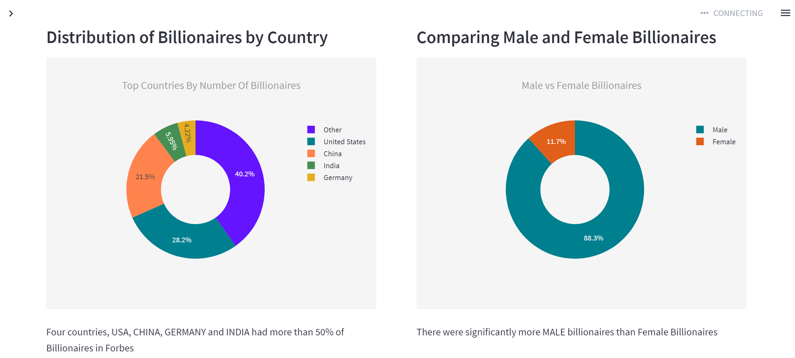

# Analysis of World's Billionaires in 2022 as Listed by Forbes

The objective of this project is to analyze and visualize the data on the world's richest people (in US Dollars) in 2022 as listed by Forbes (The Billionaires List). The Billionaires List is an annual ranking of the world's wealthiest individuals, based on their net worth, as determined by Forbes.
The project will also explore the source of wealth for the world's richest people in 2022, identifying the industries and sectors that are driving wealth creation at the highest levels. This analysis will provide insight into the global economy and the trends that are shaping it.
The dataset for this project was extracted from [forbes](https://www.forbes.com/billionaires/page-data/index/page-data.json)

# Results

## Data Extraction and Analysis Notebooks

* 
* 

# Streamlit App

I created a streamlit app to present my findings. Here is the [LINK](https://regan-mu-2022-forbes-billionaires-analysis-dashboardapp-wx2psu.streamlit.app/)

# Contribution

* If you feel there's something that can be added to this project, your pull requests are welcome.
